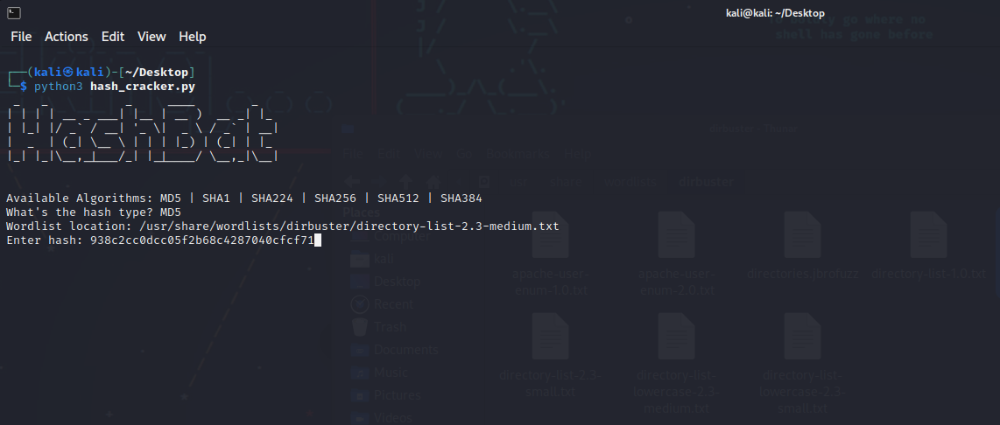

# HashBat
a Hash Cracker tool made with Python

```
- md4
- md5
- sha1
- sha224
- sha256 
- sha384
- sha512
```
# [ Installation ]
```
$ apt update upgrade
$ apt install python3 git
$ git clone https://github.com/bakruu/HashBat
$ cd HashBat
$ python3 hash_cracker.py
```

# Screenshot

